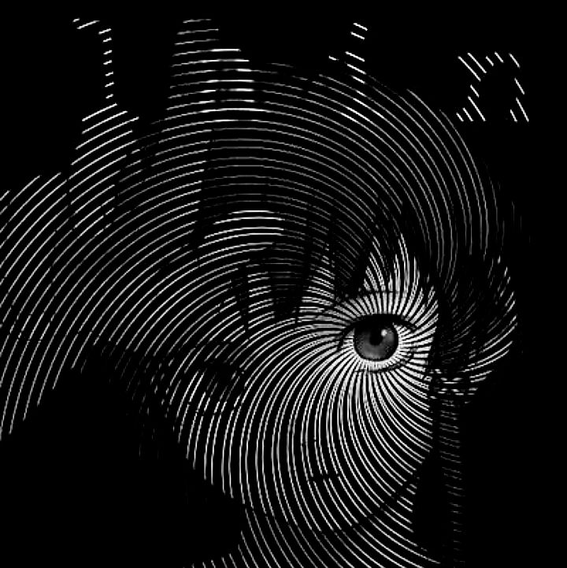
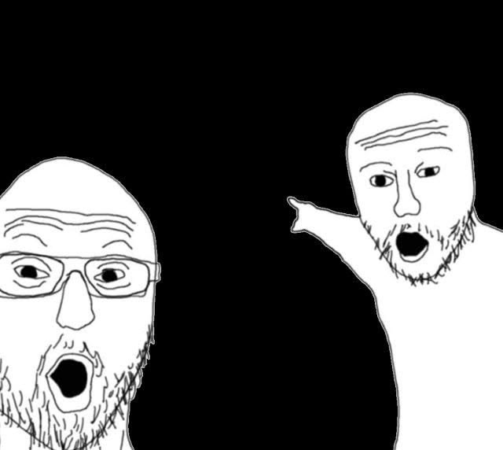

# 

  <!-- BANNER PERSONALIZADO -->
  

    

  ## Know About Me

<!-- SEÇÃO SOBRE MIM -->
<table width="100%" border="0" cellspacing="0" cellpadding="0">
  <tr>
    <td width="65%" valign="top">
      <h3>Hey there! I'm Vitória</h3>
      
Cursando o 2° semestre de Engenharia de Software alimentada por café e uma leve obsessão por designs minimalistas em preto e branco, ou simplesmente FOFOS. Durante o dia, tento entender como o JavaScript funciona e ajudo na resolução de problemas práticos de suporte. Durante a noite, me dedico à arte dos desenhos tradicionais (já que o mundo digital de desenho ainda é um grande mistério para mim) ou viro uma fora da lei cavalgando em RDR2...

    </td>
    <td width="35%" align="right" valign="middle">
      <!-- IMAGEM DA LAIN ESPIRAL (Aumentada para 200) -->
      
    </td>
  </tr>
</table>

 

<!-- SEÇÃO TOP PROJECTS -->
<table width="100%" border="0" cellspacing="0" cellpadding="0">
  <tr>
    <td width="65%" valign="top">
      <h3>Top Projects (built to avoid manual labor)</h3>
       
      <!-- PROJETO 1: BABYGUARD -->
      

        
        &nbsp;&nbsp;Plataforma web focada em soluções práticas para monitoramento e gestão escolar.
      

      <!-- PROJETO 2: RESERVADO -->
      

        
        &nbsp;&nbsp;Em desenvolvimento... O próximo grande passo usando JavaScript básico.
      

    </td>
    <td width="35%" align="right" valign="middle">
      <!-- BOTÃO START DO MINECRAFT (Aumentado para 200) -->
      
    </td>
  </tr>
</table>

 

  ## Connect

  <!-- LINKS E REDES SOCIAIS MINIMALISTAS PRETAS E BRANCAS -->
  &nbsp;
  &nbsp;
  &nbsp;
  

    
  
  

